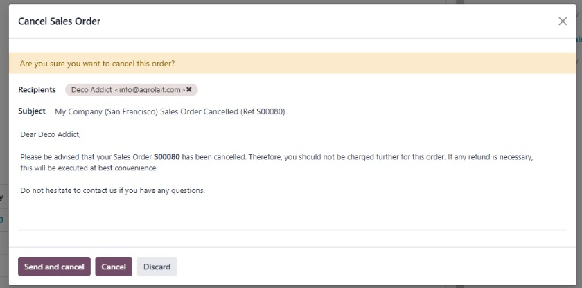
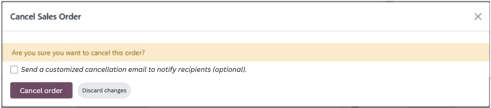
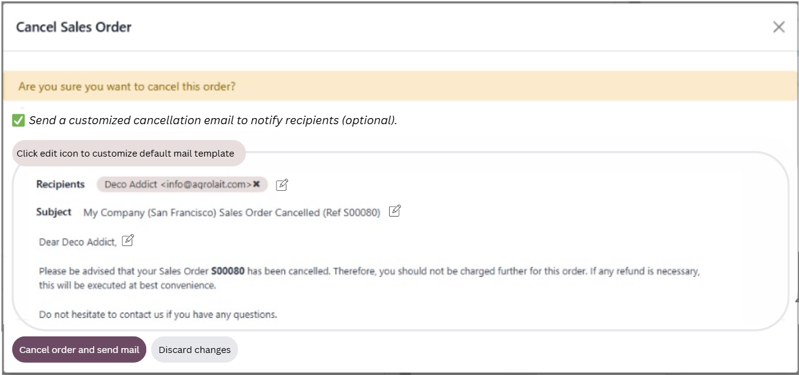

---
date:
  created: 2025-01-14
---

# **Supporting user decisions with UX writing**

You know there are times when an unexpected event occurs, and it's not apparent what caused that mistake. You dig deeper and discover a surprising revelation. I recently stumbled on a similar scenario. 

<!-- more -->

## **Storytime** 

A colleague shared an incident where some sales order cancellation emails were sent out mysteriously, and the client had no idea what triggered this.

After careful debugging, my colleague figured it was most likely a misclick by a user.

I probed further out of curiosity. Turns out, the user made the blunder on encountering the [Odoo](https://www.odoo.com/) sales order cancellation modal below.

## **Identifying issues**

When I looked at the modal closely, I could hypothesize why this resulted in a mistake.

The UX copy isn't clear and misses important details. Here are some reasons why:

1. The copy doesn't specify if the users have the *option* of sending a custom cancellation mail. The knowledge of this option seems assumed. I was confused as to why a mail template appears in a cancellation modal. This wouldn't result in a smooth user experience for a new user. 

2. “Send and cancel”, “Cancel”, and “Discard” can imply the same meaning. The result of each option isn't also well defined. The cognitive load due to seemingly similar options makes it difficult for the user to make the right decision.

## **Improvement suggestions**

I asked my colleague about the actual result of each option. Based on this knowledge and personal UX writing experience, I revised the copy and added a few supplementary interface elements.

### **How is this better?**

1. The copy (next to the checkbox) now clearly indicates the option to send a cancellation mail. This opens a dedicated panel to customize the mail.

2. The decision-making flow is now more intuitive and less overwhelming.
    * If the user wants to simply cancel the order, they can click “Cancel order”, without thinking about the mail.
    * If the user wants to cancel *and* send a sales order cancellation mail, the copy now indicates the combined option to “Cancel order and send mail”.
    
    The result of each action is clearly communicated.

>*Disclaimer: This is far from perfect, but I feel it's an improvement over the initial experience.*

## **Takeaway** 

My takeaway is that, more often than not, the user's experience can always be improved for easy and error-free decision-making.
